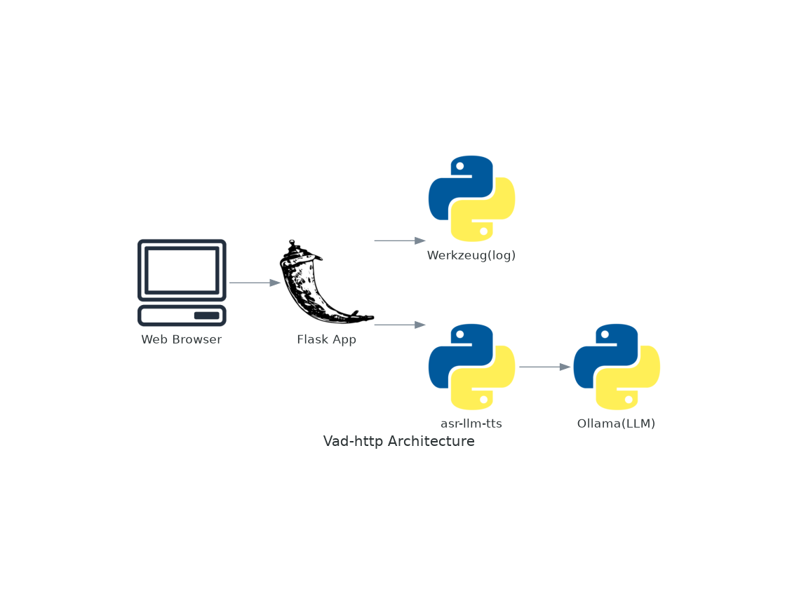

# Vad-http
Conversation http software with simple client based on ces-2025

CES-2024 の、ロボット同士の日本語の 会話モジュール をベースに http 化したコード。

## Install

envs/ 以下のファイルを必要に応じて適切なところに配置する。

#### anaconda envs. の install
anconda の環境ファイルを install している directory を、anaconda prompt から確認する。

```bash
> conda env list
```

ここで 得られた directroy に、下記に示す anaconda env を展開する。
上記のコマンドで再度、一覧を取得して、asr-llm-tts-h0 という環境が登録されていることを確認する。


#### ESPnet2(TTS)
ESPnet2 に関して、error が発生したら、下記のリンクから取得して、参照している Python コードの directory に、展開する。


## Files

環境ファイル, Package file について、
andconda 環境ファイル、ESPnet2(TTS) package は、envs/ ディレクトリにない。
必要に応じて、以下のリンクから取得のこと

#### ESPnet2
Python ESPnet2 pacakge
* espnet.7z
[ESPnet2](https://drive.google.com/file/d/1uRfDOklI5dzoTO5_khvvBd1IRUmeM1LH/view?usp=sharing)


#### anaconda env. file
ASR(whisper)/Python-Ollma/ESPnet2 が構築されている環境ファイル。
ESPnet2 は、特定の Python package を利用する必要があるため、requirements ではなく andconda envs. にまとめてある。
* asr-llm-tts-h0.7z
[asr-llm-tts-h0](https://drive.google.com/file/d/16jkCv0I_4FtVR3X8BJ15EFA7V9wDlgne/view?usp=sharing)


## Usage

#### http server の起動
anaconda prompt コンソールで、次のコマンドにより、http server を起動させる。

```bash
cd src
python http_app.py
```


#### Frontend のアクセス
http server を起動されたときに表示される URL を、ブラウザからアクセスする。


#### Frontend の利用方法

* "開始"ボタンで、会話システムが開始される。
* "終了"ボタンで、会話のターンが完了した時点で、会話システムを終了できる。(未テスト)
* "強制終了"ボタンで、会話を強制終了させることができる。(未テスト)
* 会話セッションが 120 秒を超えたら、会話システムが終了する。

具体的な利用方法は、次の 動画 を参照のこと。

[動作例](https://microsjp.sharepoint.com/:v:/s/BlockchainLab/ET-6OcZKe8pErGmHXwqJO6sBP7LppPz9k_2ZqTT1CwC7uQ?e=MpoxHm)

この例では、次の URL を指定している。

```
http://127.0.0.1:5000
```

## Appendex A, Basic design

vad-http の構成図を次に示す。




この図を修正したい場合は、対応する Python code を修正した後、次のコマンドを与える。
(diagrams package を install していない場合は、pip install diagrams でインストールするる。)

```bash
python design.py
```
